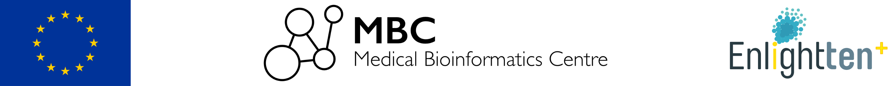

# Bioinfo_Tcell_projects_22 

EMBL-EBI scRNA Bioinformatics T cell course 2022

 

 

---

 

 

Repository: Projects to develop during the 'Bioinformatics for T-Cell immunology' course (11-15/07/2022) at EMBL-EBI: [https://www.ebi.ac.uk/training/events/bioinformatics-t-cell-immunology-2022](https://www.ebi.ac.uk/training/events/bioinformatics-t-cell-immunology-2022)

Official website: [https://elolab.github.io/Bioinfo_Tcell_projects_22](https://elolab.github.io/Bioinfo_Tcell_projects_22)

Maintainer: [Elo lab](https://elolab.utu.fi) 

Contact: **António Sousa** ([ENLIGHT-TEN+](http://www.enlight-ten.eu) PhD student at the [Medical Bioinformatics Centre](https://elolab.utu.fi), TBC, University of Turku & Åbo Akademi) 

Last update: 07/07/2022

 

 

---

 

 

### Disclaimer

>All the data used along each project notebook was made public elsewhere by the respective authors and it has been properly referenced in each project (proper links were provided along each project notebook). The data and tools chosen to address the topic(s) of each project notebook reflect only my personal experience/knowledge and they were chosen to highlight particular aspects that I consider important. The results generated and explored within each project notebook have just the general purpose of give a brief introduction to the topics addressed in each project and do not aim, at any point, to reproduce or question neither the approaches taken nor the main findings published along with the data sets used herein.

 

 

---

 

 

### Acknowledgements

>This project has received funding from the European Union's Horizon 2020 research and innovation programme under the Marie Skłodowska-Curie grant agreement No.: 955321

 

 

 

---

 

 

Shield: [![CC BY 4.0][cc-by-shield]][cc-by]

This work is licensed under a
[Creative Commons Attribution 4.0 International License][cc-by].

[![CC BY 4.0][cc-by-image]][cc-by]

[cc-by]: http://creativecommons.org/licenses/by/4.0/
[cc-by-image]: https://i.creativecommons.org/l/by/4.0/88x31.png
[cc-by-shield]: https://img.shields.io/badge/License-CC%20BY%204.0-lightgrey.svg
